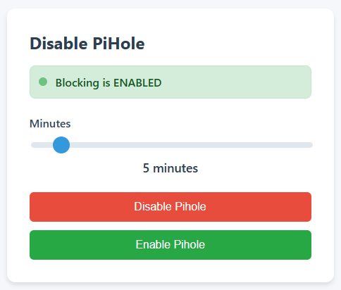

# Pi-hole Unblocker



A small python app that provides a web interface to remotely enable/disable Pi-hole's DNS blocking feature for a configurable duration. This can be published on your LAN to provide to end-users as an easy method to temporarily disable ad-blocking. To make it simple, there is no user login for the end user.

## Key Features

- **Security:** API secret (generated at startup via `secrets.token_hex(32)`) injected into the frontend; constant-time comparison for secret validation
- **Configuration via environment variables:** `PIHOLE_URL`, `PIHOLE_PASSWORD`, `SERVER_PORT`, `SESSION_TIMEOUT`, `PIHOLE_TIMEOUT`
- **Proxy-aware IP detection:** Supports `X-Forwarded-For`, `X-Real-IP`, and RFC 7239 `Forwarded` headers
- **Graceful shutdown:** Signal handlers for SIGINT/SIGTERM, proper session cleanup
- **SSL context reuse** across requests for performance
- **Thread-safe session management** with automatic retry on expired sessions

## Installation

### Option 1: Install to /opt (Recommended for systemd service)

This is the recommended approach for production deployments using systemd:

```bash
# Create a new user for the service
sudo useradd --system --no-create-home --shell /usr/sbin/nologin --comment "Unblock PiHole service" unblock-pihole

# Create the installation directory
sudo mkdir -p /opt/unblock_pihole
sudo chown unblock-pihole:unblock-pihole /opt/unblock_pihole

# Clone the repository. First switch to the new user
sudo -u unblock-pihole /usr/bin/bash
cd /opt/unblock_pihole
git clone <repository-url> .

# Create and activate a virtual environment
python3 -m venv .venv
source .venv/bin/activate

# Install the package in editable mode - ignore the cache warning if you get it (no home dir)
pip install -e .
```

### Option 2: Install system-wide

```bash
# Clone the repository
git clone <repository-url>
cd pihole_unblocker

# Install system-wide (may require sudo)
pip install .
```

### Option 3: Development install

```bash
# Clone the repository
git clone <repository-url>
cd pihole_unblocker

# Create and activate a virtual environment
python3 -m venv .venv
source .venv/bin/activate

# Install in editable/development mode
pip install -e .
```

## Configuration

Create a `.env` file with the required configuration. The file should be placed at the path referenced by your deployment method. For example, for a systemd install, create it in /opt/unblock_pihole:

```bash
PIHOLE_URL=https://pihole.example.com
PIHOLE_PASSWORD=your_password
SERVER_PORT=12345
SESSION_TIMEOUT=60
PIHOLE_TIMEOUT=5
```

You will need to obtain an API password from your pihole using the "Configure app password" option under `Settings -> Web interface / API`.

## Updating

If you have installed this as a systemd service, into `/opt/unblock_pihole` and you have it running as its own `unblock-pihole` user, run the following script to update everything. This can be run as any user with `sudo` privileges.

```bash
#!/bin/bash
set -e

sudo -u unblock-pihole git -C /opt/unblock_pihole pull
sudo -u unblock-pihole /opt/unblock_pihole/.venv/bin/pip install --no-cache-dir -e /opt/unblock_pihole
sudo systemctl restart unblock_pihole
```

## Usage

### Running via systemd (recommended for production)

1. Install the package to `/opt/unblock_pihole` (see Installation above)

2. Create the `.env` file at `/opt/unblock_pihole/.env`:
   ```bash
   PIHOLE_URL=https://pihole.example.com
   PIHOLE_PASSWORD=your_password
   SERVER_PORT=12345
   SESSION_TIMEOUT=60
   PIHOLE_TIMEOUT=5
   ```

3. Copy the service file and enable it:
   ```bash
   sudo cp systemd/unblock_pihole.service /etc/systemd/system/
   sudo systemctl daemon-reload
   sudo systemctl enable unblock_pihole
   sudo systemctl start unblock_pihole
   ```

4. Check status:
   ```bash
   sudo systemctl status unblock_pihole
   ```

### Running from command line

```bash
# Set required environment variables
export PIHOLE_URL="https://pihole.example.com"
export PIHOLE_PASSWORD="your_password"

# Run using the package module entry point
python -m unblock_pihole

# Or use the installed command-line entry point (after pip install)
unblock_pihole
```

### With custom port

```bash
SERVER_PORT=8080 python -m unblock_pihole
```

### How the module path works

When running `python -m unblock_pihole`, Python searches for the `unblock_pihole` package in:
1. The current working directory
2. Directories listed in `sys.path` (includes the directory of the script being run)
3. Python's site-packages (where `pip install` places packages)

For the systemd service, the `ExecStart` uses the full path to the virtual environment's Python interpreter (`/opt/unblock_pihole/.venv/bin/python`), and since the package is installed in that virtual environment, Python can find `unblock_pihole` automatically.

## API Endpoints

| Method | Endpoint | Description |
|--------|----------|-------------|
| GET | `/` | Main control panel page |
| GET | `/api/status` | Get current blocking status |
| POST | `/api/disable` | Disable blocking (body: `{"timer": 5}`) |
| POST | `/api/enable` | Enable blocking immediately |

All API endpoints require the `X-Backend-Secret` header with the value generated at server startup.

## License

MIT

## AI Statement
This project was developed with the assistance of AI.
I mostly used Qwen 3.6 integrated with VS Code and Cline.
I also used Claude.ai for other general advice.